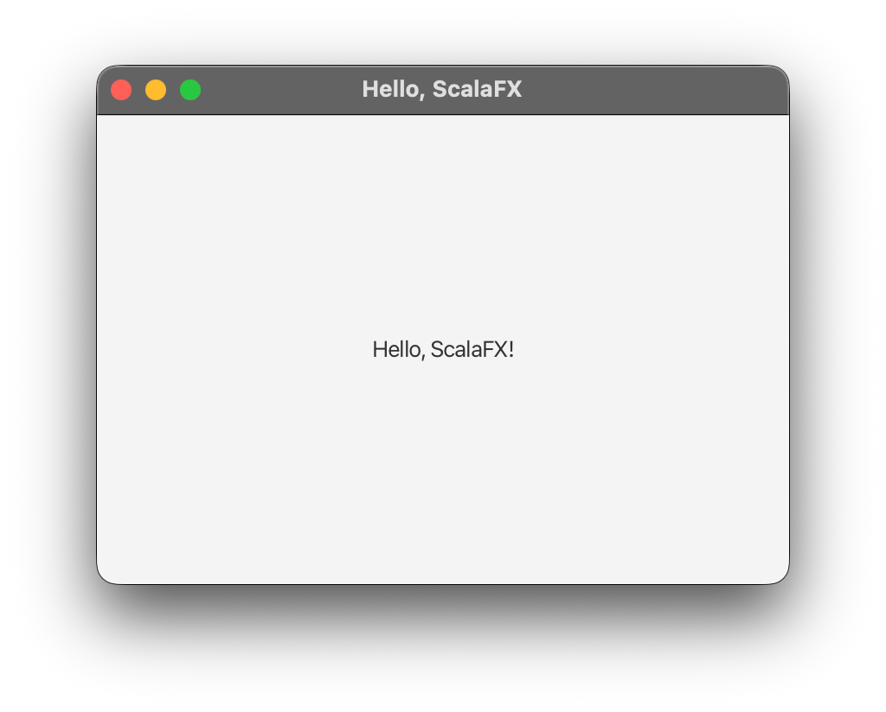

## Your First ScalaFX App

Create `src/main/scala/HelloWorld.scala`:

```scala
import scalafx.application.JFXApp3
import scalafx.scene.Scene
import scalafx.scene.control.Label
import scalafx.scene.layout.StackPane

object HelloWorld extends JFXApp3 {
  override def start(): Unit = {
    stage = new JFXApp3.PrimaryStage {
      title = "Hello, ScalaFX"
      width = 400
      height = 300
      scene = new Scene {
        root = new StackPane {
          children = new Label("Hello, ScalaFX!")
        }
      }
    }
  }
}
```



Run it with `sbt run`. A 400×300 window titled "Hello, ScalaFX" should appear with the text centered in it.

### Walking through the code

- **`extends JFXApp3`**: this trait provides the application entry point and lifecycle plumbing so you don't have to write a `main` method or extend JavaFX's `Application` class by hand.
- **`override def start(): Unit`**: ScalaFX calls this once the JavaFX runtime is ready. This is where you build your UI — never construct stages/scenes outside this method (see the threading note below).
- **`stage = new JFXApp3.PrimaryStage { ... }`**: a `Stage` is the top-level window. Assigning to `stage` here tells ScalaFX "this is the window to show."
- **`scene = new Scene { ... }`**: a `Scene` holds the actual content (the node graph) that gets drawn inside the stage.
- **`root = new StackPane { children = ... }`**: every scene needs a single root node. `StackPane` is one of the simplest layout containers — it stacks children on top of each other, centered by default.

### A note on threading

Creation or modification of JavaFX/ScalaFX UI elements must run on the **JavaFX Application Thread**. 
`start()` is already called on that thread, so code inside it can safely construct the app.
More complex applications may need to run longer operations.
To prevent the UI from locking up, longer-running operations (network calls, long computations) need to run outside the JavaFX Application Thread.
You can ensure that code is running outside the JavaFX Application Thread using `Platform.runLater`.
We cover this later in the Concurrency section.