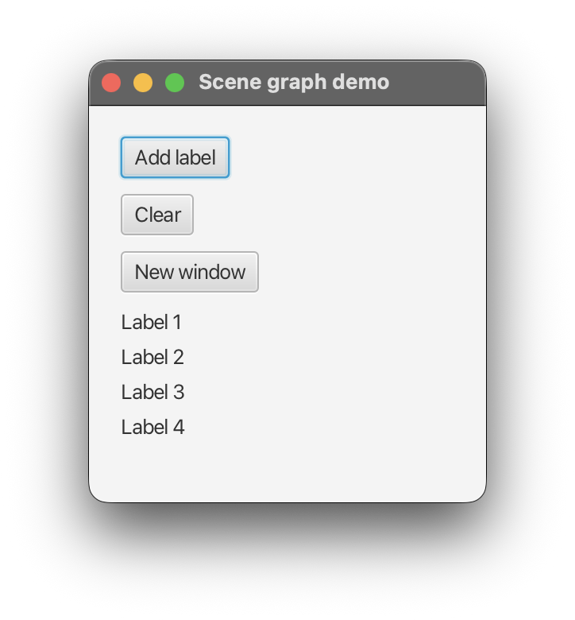

## Stage, Scene, and Node

A ScalaFX window is defined by a hierarchy of three kinds of objects: a `Stage`, a `Scene`, and a tree of `Node`s.
the section [Anatomy of a ScalaFX Application](../01-getting-started/05-anatomy-of-a-scalafx-application.md) introduced them.
This page looks at each one more closely.

### The scene graph

A window's content is a tree called the **scene graph**.

```
Stage                        the window
 └── Scene                   one per stage
      └── root (Parent)      one root node
           ├── Node          leaf: Label, Button, Rectangle, ...
           └── Parent        branch: a pane with its own children
                ├── Node
                └── Node
```

The simple rules:

- A stage shows one scene at a time.
- A scene has exactly one root node.
- A node has at most one parent. If you add a node to a second parent, JavaFX removes it from the first.
- Only `Parent` nodes can have children.

### Stage

A `Stage` is a top-level window.
Common properties:

| Property        | Meaning                                       |
|-----------------|-----------------------------------------------|
| `title`         | Text in the title bar                         |
| `width`/`height`| Window size                                   |
| `resizable`     | Whether the user can resize the window        |
| `scene`         | The scene being shown                         |
| `showing`       | Read-only. `true` while the window is visible |

Common methods: `show()`, `hide()`, `close()`, and `showAndWait()`.
`showAndWait()` blocks until the window closes. Use it for dialogs.

Your application has one **primary stage**, provided by `JFXApp3`.
You can create as many other stages as you need:

```scala 3
val second = new Stage:
  title = "Second window"
  scene = new Scene(250, 100):
    root = new StackPane:
      children = new Label("A second Stage")

second.show()
```

Stages can also be linked.
Set the *owner* and the *modality* of a stage before you show it, to make a dialog that blocks its parent window:

```scala 3
second.initOwner(stage)
second.initModality(Modality.WindowModal)
```

Those calls must happen before the stage is shown.

Dialogs and alerts are built using `Stage`. 
ScalaFX also provides a dedicated `Dialog`/`Alert` API that simplifies the process and provides some predefined alerts. 
A later section covers it in detail.

### Scene

A `Scene` holds the content of a stage.
It has a `root` node and a few scene-wide properties: `fill` (the background), `stylesheets` (CSS files), and its size.

```scala 3
val scene = new Scene(400, 300):
  root = new VBox:
    children = new Label("Content goes here")
  fill = Color.LightGray  
```

If you give the scene a size, the window takes that size.
If you leave it out, the window is as big as its content and layout defines.

The `root` must be a `Parent`, usually a layout pane. The next section covers layout panes.

You could skip the root and set `content` instead.
A new ScalaFX scene starts with an empty `Group` as its root, and `content` puts your nodes into that group:

```scala 3
val scene = new Scene:
  content = Seq(new Label("One"), new Label("Two"))
```

A layout pane is a better choice for real applications, because it positions its children for you.


To show a different screen, assign a new scene to the stage:

```scala 3
stage.scene = anotherScene
```

### Node

`Node` is the base class of everything in a scene graph.
The classes you will use most fall into a small hierarchy:

```
Node
 ├── Parent                        can have children
 │    ├── Group                    plain container, no layout
 │    └── Region                   has size, padding, background, borders
 │         ├── Pane                a Region with a public `children` list
 │         │    ├── StackPane, VBox, HBox, BorderPane, GridPane, ...
 │         └── Control             interactive widgets
 │              ├── Labeled
 │              │    ├── Label
 │              │    └── ButtonBase
 │              │         └── Button, CheckBox, ...
 │              └── TextInputControl
 │                   └── TextField, TextArea, ...
 ├── Shape                         2D shapes
 │    └── Rectangle, Circle, Text, ...
 ├── ImageView
 └── Canvas
```

Every node has properties that describe its state.
You will meet these often:

| Property      | Meaning                                                    |
|---------------|------------------------------------------------------------|
| `id`          | A name for lookup and CSS                                  |
| `visible`     | Whether the node is drawn                                  |
| `disable`     | Whether the node ignores user input                        |
| `style`       | Inline CSS                                                 |
| `parent`      | Read-only. The node's parent, or `null`                    |
| `scene`       | Read-only. The scene that contains the node, or `null`     |

### Working with children

The children of a `Parent` live in an `ObservableBuffer` named `children`.
Use it like any Scala mutable buffer:

```scala 3
box.children += new Label("Added") // add at the end
box.children.clear() // remove all
```

Order of children matters.
In a `VBox`, it sets the top-to-bottom order.
In a `StackPane` or a `Group`, later children are drawn on top of earlier ones.

### Moving around the scene graph

A node knows where it lives.
`parent`, `scene`, and the scene's `window` let you walk up the tree.
All three are properties, so read them with `.value`:

```scala 3
val label = new Label("x")
label.parent.value // null: not added to a parent yet

box.children += label
label.parent.value // the box
label.scene.value // null until the box is in a scene
```

To search downward, give a node an `id` and use `lookup` with a CSS-style selector:

```scala 3
val found = box.lookup("#greeting")
```

`lookup` returns a plain `Node`.
Keep a reference to the node yourself when you need its specific type.
In most programs you will hold references in `val`s, and you will not need `lookup` often.

### Putting it together

This program has a primary window and a button that opens a second one.
Two more buttons add and remove nodes from the scene graph.

```scala 3
import scalafx.Includes.*
import scalafx.application.JFXApp3
import scalafx.geometry.Insets
import scalafx.scene.Scene
import scalafx.scene.control.{Button, Label}
import scalafx.scene.layout.{StackPane, VBox}
import scalafx.stage.Stage

object SceneGraphDemo extends JFXApp3:

  override def start(): Unit =
    val items = new VBox:
      spacing = 5

    val addButton = new Button("Add label"):
      onAction = _ => items.children += new Label(s"Label ${items.children.size + 1}")

    val clearButton = new Button("Clear"):
      onAction = _ => items.children.clear()

    val windowButton = new Button("New window"):
      onAction = _ =>
        val second = new Stage:
          title = "Second window"
          scene = new Scene(250, 100):
            root = new StackPane:
              children = new Label("A second Stage")
        second.show()

    stage = new JFXApp3.PrimaryStage:
      title = "Scene graph demo"
      scene = new Scene(250, 250):
        root = new VBox:
          spacing = 10
          padding = Insets(20)
          children = Seq(addButton, clearButton, windowButton, items)
```

Click **Add label** a few times, then **Clear**.
Each click changes the scene graph, and JavaFX redraws the window.
Click **New window** to create a second stage.



### Summary

- A `Stage` is a window. It shows one `Scene`.
- A `Scene` has one root `Parent` node.
- Nodes form a tree. Each node has at most one parent.
- `children` is an `ObservableBuffer`. Add and remove nodes at any time, on the JavaFX Application Thread.
- Read `parent`, `scene`, and `window` to move up the tree.
