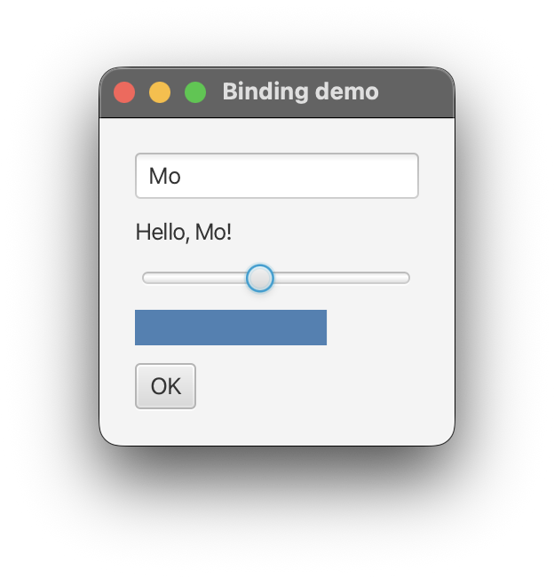

## Properties and Bindings

Properties are a key concept in ScalaFX; they help the UI update itself with little code.

### What is a property?

A property holds a value and tells others when that value changes.
Almost every attribute in the UI is a property:

- `label.text`
- `rectangle.width`
- `node.visible`
- `stage.title`
- `slider.value`

A plain Scala `var` holds a value; when it is reassigned, it issues no notification of change.
A property also lets you:

- **listen** for changes,
- **bind** it to another property, so it follows that property automatically.

### Reading and writing

A property's value is available through `value`.
Assignments to a ScalaFX property using `=`, like `label.text = "Hi"`, set that value.

```scala 3
val name = StringProperty("Desmond")

name.value            // "Desmond"
name()                // "Desmond"   (short form)

name.value = "Julia"
name() = "Rita"        // short form
```

Remember that `label.text` is the property itself.
To get the `String`, use `label.text.value`.

You can create your own properties.
ScalaFX has one for each common type:

| Property               | Holds           |
|------------------------|-----------------|
| `StringProperty`       | `String`        |
| `IntegerProperty`      | `Int`           |
| `DoubleProperty`       | `Double`        |
| `BooleanProperty`      | `Boolean`       |
| `ObjectProperty[T]`    | any `T`         |

They are in the `scalafx.beans.property` package.

### Listening for changes

Use `onChange` to listen when a value is changing:

```scala 3
name.onChange((_, oldValue, newValue) => println(s"Changed from $oldValue to $newValue"))
name.onChange(println("Changed"))     // when you do not need the values
```

The listener receives the property, the old value, and the new value.

`onChange` returns a `Subscription`.
Call `cancel()` on it to stop listening:

```scala 3
val subscription = name.onChange(println("Changed"))
subscription.cancel()
```

### One-way binding: `<==`

Binding makes one property follow another.
The property on the left takes its value from the right, and stays in sync.

```scala 3
val source = StringProperty("first")
val target = StringProperty("")

target <== source
target.value            // "first"

source.value = "second"
target.value            // "second"
```

This is how you connect UI elements without listeners.
The `label` below always shows what is typed into the `textField`:

```scala 3
label.text <== textField.text
```

A bound property cannot be set by hand.
Trying to do so throws a `RuntimeException`: *A bound value cannot be set.*
Call `unbind()` first:

```scala 3
target.unbind()
target.value = "third"
```

### Two-way binding: `<==>`

`<==>` keeps two properties bound in both directions.
Whenever either property changes value, the other updates
Initially, when you create the binding, the left property takes the right property's current value.

```scala 3
val a = IntegerProperty(1)
val b = IntegerProperty(2)

a <==> b
a.value            // 2

b.value = 10
a.value            // 10

a.value = 20
b.value            // 20
```

### Binding to expressions

The right side of `<==` can be an expression.
The result updates whenever any property in the expression changes.

```scala 3
bar.width <== slider.value * 3                  // arithmetic
okButton.disable <== nameField.text.isEmpty     // disabled while the field is empty
label.text <== counter.asString()               // number to text
```

Numbers support the usual operators (`+`, `-`, `*`, `/`) and comparisons (`>`, `>=`, `<`, `<=`, `===`).
Comparisons produce a boolean, which you can bind to properties such as `visible` or `disable`:

```scala 3
warning.visible <== temperature > 100
```

To choose between two values based on a value of a boolean property, use `Bindings.when`:

```scala 3
import scalafx.beans.binding.Bindings

box.spacing <== Bindings.when(compact) choose 2 otherwise 10
```

You can also use `map` as an expression:

```scala 3
greeting.text <== nameField.text.map(name => s"Hello, $name!")
```

When you need to combine several properties in a custom way, use `Bindings.createStringBinding` (or `createDoubleBinding`, and so on):

```scala 3
label.text <== Bindings.createStringBinding(
  () => s"${first.value} ${last.value}",
  first, last
)
```

**A common mistake.**
Order of operations matters; the first element of an expression needs to be a property. 
Joining a `String` and a property with `+` does not create a binding.
It performs ordinary string concatenation and returns a `String`, not an observable value.
The compiler rejects it after `<==`:

```scala 3
label.text <== "Hello, " + nameField.text         // does not compile
label.text <== nameField.text.map("Hello, " + _)  // right
```

### A complete example

The program below uses three bindings and no listeners.

```scala 3
import scalafx.application.JFXApp3
import scalafx.geometry.Insets
import scalafx.scene.Scene
import scalafx.scene.control.{Button, Label, Slider, TextField}
import scalafx.scene.layout.VBox
import scalafx.scene.paint.Color
import scalafx.scene.shape.Rectangle

object BindingDemo extends JFXApp3:

  override def start(): Unit =
    val nameField = new TextField:
      promptText = "Your name"

    val greeting = new Label:
      text <== nameField.text.map(name => s"Hello, $name!")

    val slider = new Slider(0, 100, 10)

    val bar = new Rectangle:
      height = 20
      fill = Color.SteelBlue
      width <== slider.value * 2.5

    val okButton = new Button("OK"):
      disable <== nameField.text.isEmpty

    stage = new JFXApp3.PrimaryStage:
      title = "Binding demo"
      scene = new Scene:
        root = new VBox:
          spacing = 10
          padding = Insets(20)
          children = Seq(nameField, greeting, slider, bar, okButton)
```

Try it:

- The greeting follows the text field as you type.
- The bar grows and shrinks with the slider.
- The **OK** button stays disabled until you type a name.

No explicit code reacts to typing or dragging.
The bindings do that work.



### When to use what

| **You want to...**                                | **Use**                      |
|---------------------------------------------------|------------------------------|
| Make one value follow another                     | `<==`                        |
| Keep two values equal, both ways                  | `<==>`                       |
| Show a value computed from others                 | `<==` with an expression     |
| Run code (a side effect) when something changes   | `onChange`                   |

Prefer bindings when a value *depends on* other values.
Use `onChange` when something *should happen*, such as saving a file or writing to a log.

### Summary

- A property holds a value and reports changes. Read and write it through `value`.
- `onChange` runs code when the value changes.
- `<==` binds a property to another property or an expression. `<==>` binds two properties in both directions.
- A bound property cannot be set by hand. Call `unbind()` first.
- Use `map`, `Bindings.when`, and the number and string operators to build expressions.

Bindings and collections of observable data are covered further in *Working with Data*.
